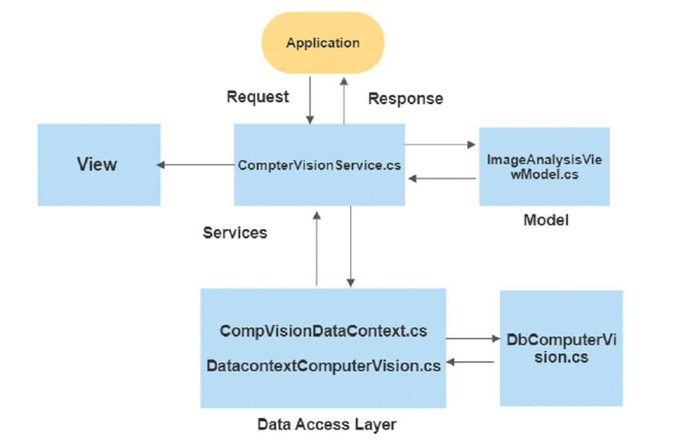

# AzureB2C

## Project Architecture

## Documentation

### View: 
- Index.cshtml:

    Index.cshtml file is a view file that represents the user interface of an MVC application.
  It contains an async method to upload images and is responsible for rendering the interface to the user in the web browser.

### Services:

A service is a component that provides a set of related functions or operations that can be performed
 on a given domain. Services are typically used to encapsulate business logic or to access external resources, such as databases or third-party APIs.

In CompterVisionService perform the operation on image stream using ‘AnalyzeImageUrl()’ async method.

### Data Access Layer:
      
The DataContext class is typically used to represent a data context for a database. 
It is a class that is responsible for interacting with a database and performing various operations on the data stored in the database.

#### Example:

    public class CompVisionDataContext : DbContext
    {

        public DbSet<dbComputerVision> dbComputerVision { get; set; }
      
        protected override void OnConfiguring(DbContextOptionsBuilder optionsBuilder)
        {
            optionsBuilder.UseSqlServer(@"Data Source=DESKTOP-G75N66U;Initial Catalog=DocService;Integrated Security=True");
            
        }

    }

- The DbContext class is responsible for managing the entity objects in a database and handling the communication with the database
- The DataContext class has one proprietary dbComputerVision, which represent the entity sets for the dbComputerVision objects, respectively. These properties allow the DataContext to perform various operations on the data stored in the database, 
    
